## Git Configuration Commands

1. `git config --global user.name`

**syntax:**
```bash
git config --global user.name "Your Name"
```

**purpose:**
- Sets the name that will be attached to your commit transactions. This is how teammates identify who made specific changes in a shared repository.

**Example:**
```bash
git config --global user.name "raj-220556"
```
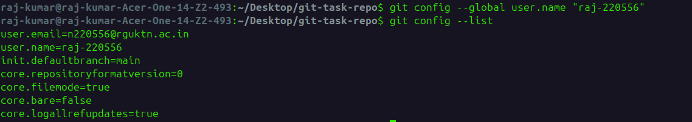

2. `git config --global user.email`

**syntax:**
```bash
git config --global user.email "yourname@example.com"
```

**purpose:**
- Associates your email address with your commits. Platforms like GitHub or GitLab use this email to link your local commits to your web profile.

**Example:**
```bash
git config --global user.email "n220556@rguktn.ac.in"
```
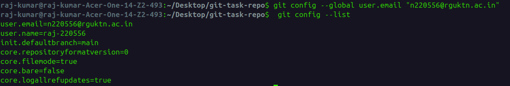


3. `git config --list`

**syntax:**
```bash
git config --list
```

**purpose:**
- Displays all the configuration settings Git can find at that moment, including your name, email, editor preferences, and alias settings. It’s the "check your work" command.

**Example:**
```bash
git config --list
```

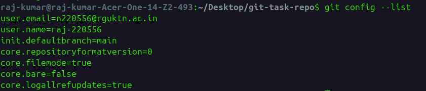

4. `git config --unset`

**syntax:**
```bash
git config --global --unset <key>
```
**purpose:**
- Removes a specific configuration setting. This is useful if you made a typo or want to revert a setting to its default state.

**Example:**
```bash
git config --global --unset user.name
```

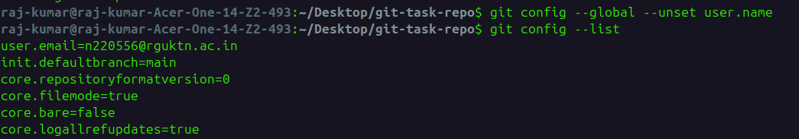


--- 


## Repository Setup Commands

1. `git init`

**syntax:**
```bash
git init
```

**purpose:**

- Initializes a new, empty Git repository in the current directory.
- Creates the hidden `.git` folder required for tracking version history.
- Converts a standard folder into a workspace where you can start tracking code changes.

**Example:**
```bash
git init
```


2. `git clone`

**syntax:**
```bash
git clone <repository-url>
```

**purpose:**
- Downloads an existing repository from a remote server (like GitHub or GitLab) to your local machine.
- Automatically creates a directory with the project name and sets up the "origin" remote.
- Downloads the full history of the project by default.

**Example:**
```bash
git clone https://github.com/raj-220556/WT-demo_git.git

```

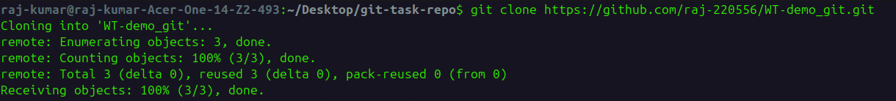


3. `git clone --branch`

**syntax:**
```bash
git clone --branch <branch-name> <repository-url>
```

**purpose:**
- Clones the repository and immediately switches (checks out) to a specific branch.
- Ideal when you want to work on a "development" or "feature" branch rather than the default "main" branch.
- Saves you the extra step of running git checkout after cloning.

**Example:**
```bash
git clone --branch feature/frontend https://github.com/raj-220556/WT-demo_git.git
```


4. `git clone --depth`

**syntax:**
```bash
git clone --depth <number> <repository-url>
```

**purpose:**
- Performs a shallow clone by only downloading the latest commits (defined by the number).
- Greatly reduces download time and disk space for massive repositories where you don't need the full 10-year history.
- Often used in automation scripts or when you just need the current state of the code.

**Example:**
```bash
git clone --depth 1 https://github.com/raj-220556/WT-demo_git.git
```


## Repository Status & Inspection

1. `git status`

**syntax:**
```bash
git status
```

**purpose:**
- Displays the state of the working directory and the staging area.
- Shows which changes have been staged, which haven't, and which files aren't being tracked by Git.

**Example:**
```bash
git status
```


2. `git log`

**syntax:**
```bash
git log
```

**purpose:**
- Shows the commit history for the current branch.
- Displays the SHA-1 hash, author, date, and the commit message.

**Example:**
```bash
git log
```

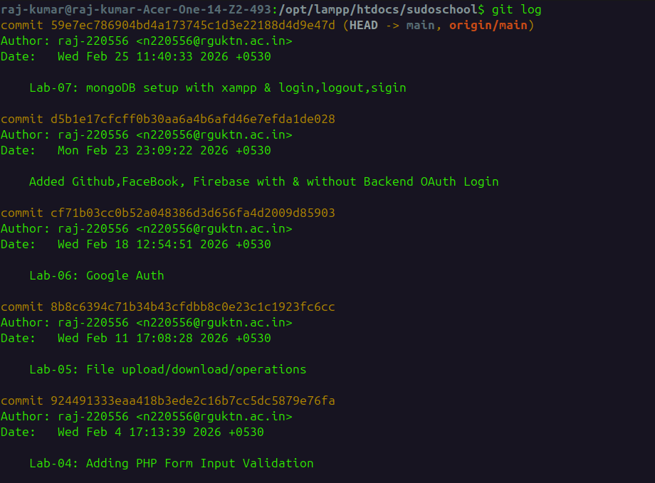


3. `git log --oneline`

**syntax:**
```bash
git log --oneline
```

**purpose:**
- Condenses each commit into a single line.
- Useful for getting a high-level overview of the project history quickly.

**Example:**
```bash
git log --oneline
```

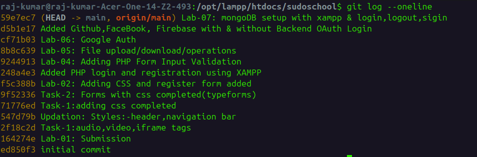


4. `git log --graph`

**syntax:**
```bash
git log --graph
```

**purpose:**
- Draws an ASCII graph representing the branch and merge history.
- Helps visualize how different branches have diverged and merged over time.

**Example:**
```bash
git log --graph
```

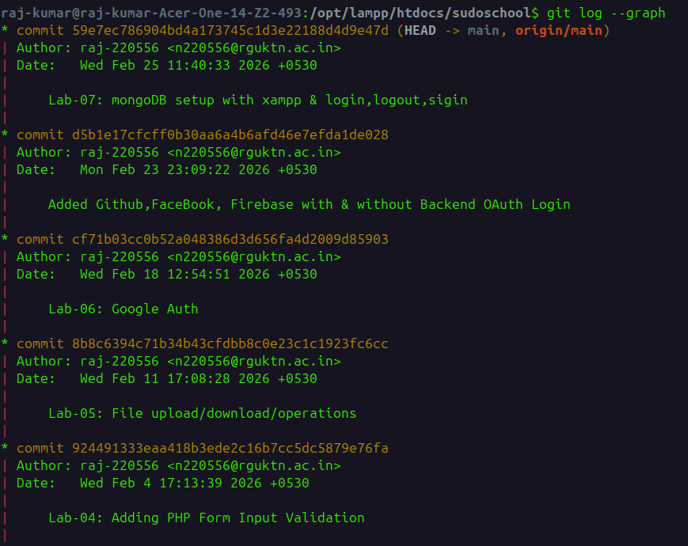

5. `git show`

**syntax:**
```bash
git show <commit-id>
```

**purpose:**
- Shows the metadata and content changes (the "diff") of a specific object, usually a commit.

**Example:**
```bash
git show d5b1e17
```

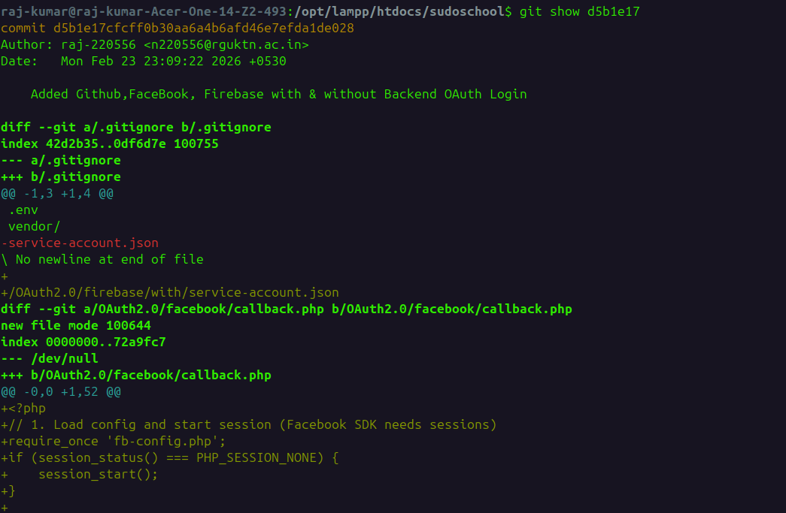

6. `git diff`

**syntax:**
```bash
git diff
```

**purpose:**
- Shows the changes between your working directory and the index (staging area).
- Specifically, it shows what you have modified but not yet added for the next commit.
- Simply addded data and not added data. It shows data that which are not added in staging area

**Example:**
```bash
git diff
```

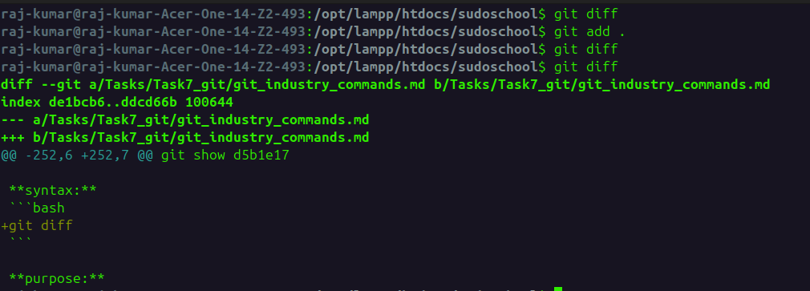


7. `git diff --staged`

**syntax:**
```bash
git diff --staged
```

**purpose:**
- Shows the changes between the **staging area and the last commit** (HEAD).
- It highlights what is about to be committed.


**Example:**
```bash
git diff --staged
```

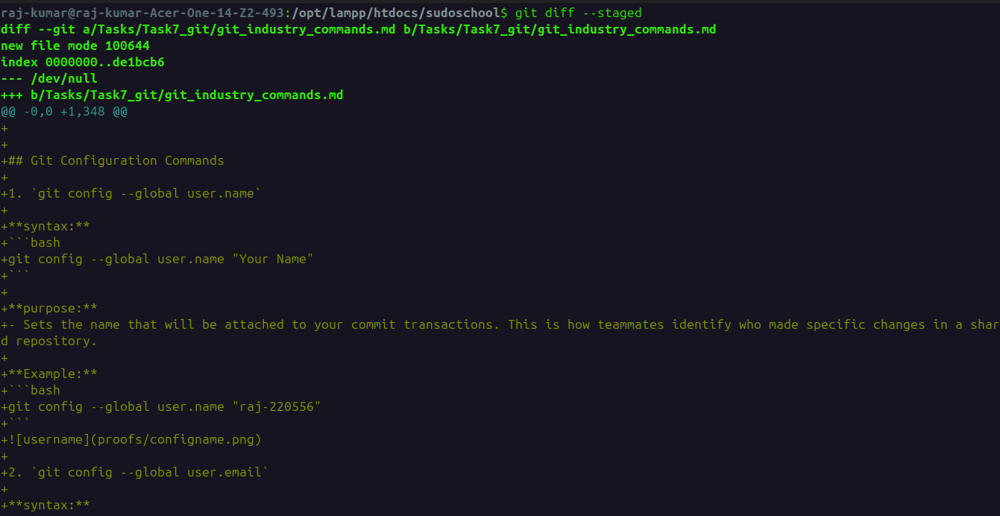

8. `git blame`

**syntax:**
```bash
git blame <file-name>
```

**purpose:**
- Displays the last modification (author and commit) for each line of a file.
- Used to track down who made specific changes in a collaborative environment.

**Example:**
```bash
git blame index.php
```

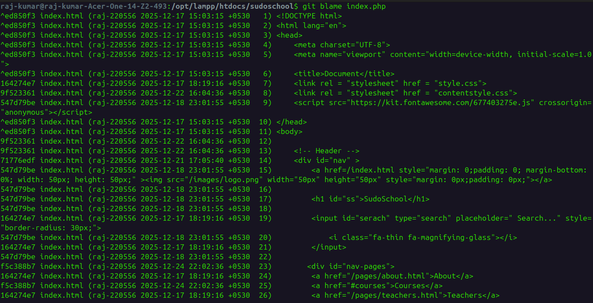

9. `git reflog`

**syntax:**
```bash
git reflog
```

**purpose:**
- Records every time the tip of a branch is updated (e.g., switches, commits, resets).
- Acts as a safety net to recover "lost" commits that aren't visible in standard logs.

**Example:**
```bash
git reflog
```

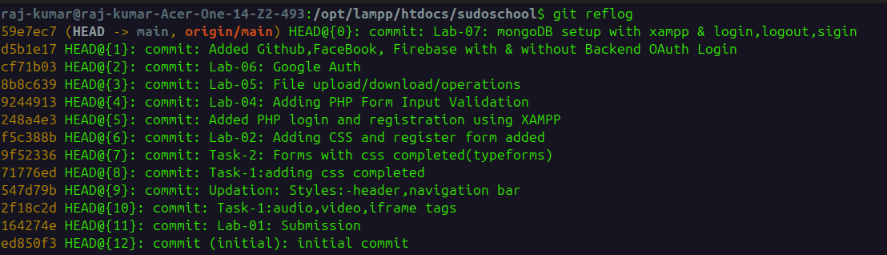

10. `git shortlog`

**syntax:**
```bash
git shortlog
```

**purpose:**
- Summarizes the git log output by grouping commits by author.
- Primarily used for creating release notes or checking contributor activity.

**Example:**
```bash
git shortlog
```

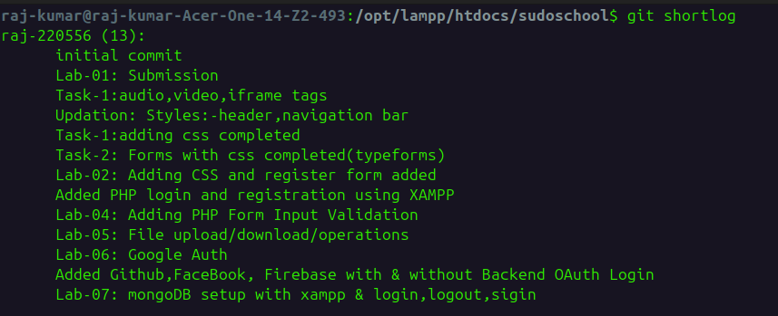


## File Tracking Commands

1. `git add`

**syntax:**
```bash
git add <file-name>
```

**purpose:**
- Adds a specific file to the Staging Area (index).
- Tells Git that you want to include updates in this specific file in the next commit.

**Example:**
```bash
git add index.php
```
- changes or new file added into staging area


2. `git add .`

**syntax:**
```bash
git add .
```

**purpose:**
- Stages all changes in the current directory and its subdirectories.
- Includes new files, modified files, and deleted files.

**Example:**
```bash
git add .
```


3. `git add -p`

**syntax:**
```bash
git add -p
```

**purpose:**
- Opens patch mode, allowing you to interactively review and stage specific "hunks" (parts) of a file.
- Excellent for keeping commits clean when you've made multiple unrelated changes in a single file.

**Example:**
```bash
git add -p
```

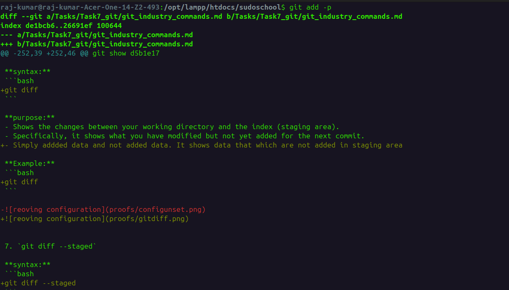

4. `git restore`

**syntax:**
```bash
git restore <file-name>
```

**purpose:**
- Discards local changes in the working directory.
- Reverts a file back to the state it was in at the last commit. Use with caution, as unstaged changes will be lost.

**Example:**
```bash
git restore index.php
```
- Removes the data that difference of working directory & staging area in working directory.

5. `git restore --staged`

**syntax:**
```bash
git restore --staged <file-name>
```

**purpose:**
- Unstages a file.
- Removes the file from the Staging Area but keeps your actual code changes in the working directory.
- Useful if you accidentally ran git add on the wrong file.

**Example:**
```bash
git restore --staged index.php
git status
```

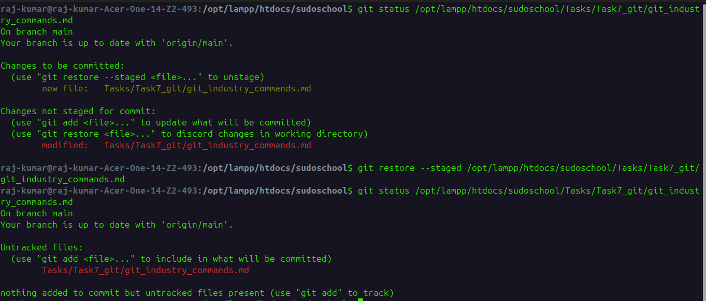


6. `git rm`

**syntax:**
```bash
git rm <file-name>
```

**purpose:**
- Removes a file from both the working directory and the Git index(staging area).
- It stages the deletion, so the file will no longer exist in the next commit.

**Example:**
```bash
git rm test.txt
```


7. `git mv`

**syntax:**
```bash
git mv <old-name> <new-name>
```

**purpose:**
- Renames or moves a file and automatically stages the change.
- It is a shortcut for renaming the file manually and then running `git rm` on the old name and `git add` on the new one.

**Example:**
```bash
git mv old.txt new.txt
```


## Commit Commands

1. `git commit`

**syntax:**
```bash
```

**purpose:**
- 

**Example:**
```bash
```


2. `git commit -m`

**syntax:**
```bash
```

**purpose:**
- 

**Example:**
```bash
```


3. `git commit --amend`

**syntax:**
```bash
```

**purpose:**
- 

**Example:**
```bash
```


4. `git commit --no-edit`

**syntax:**
```bash
```

**purpose:**
- 

**Example:**
```bash
```


## Branch Management Commands

1. `git branch`

**syntax:**
```bash
```

**purpose:**
- 

**Example:**
```bash
```


1. `git config --global user.name`

**syntax:**
```bash
```

**purpose:**
- 

**Example:**
```bash
```

